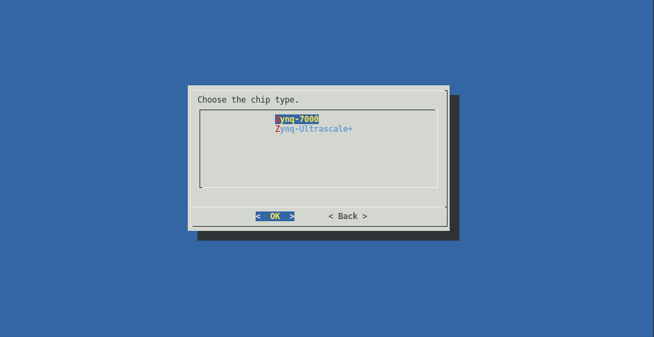
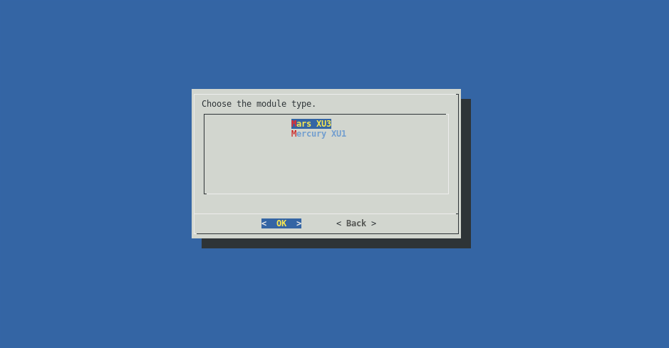
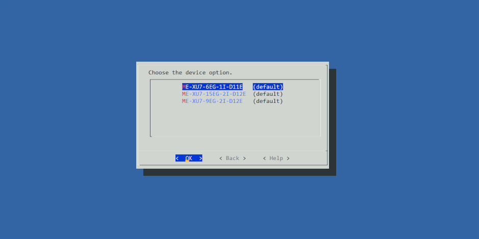

# Enclustra Build Environment - User Documentation


## Table of content

* [Introduction](./1_Introduction.md)
    - [Version Information](./1_Introduction.md#version-information)
    - [Build Environment](./1_Introduction.md#build-environment)
        - [Prerequisites](./1_Introduction.md#prerequisites)
        - [Directory Structure](./1_Introduction.md#directory-structure)
        - [Repositories Structure](./1_Introduction.md#repositories-structure)
        - [General Build Environment Configuration](./1_Introduction.md#general-build-environment-configuration)
    - [Supported Devices](./1_Introduction.md#supported-devices)
* [Graphical User Interface GUI](./2_GUI.md)
* [Command Line Interface CLI](./3_CLI.md)
* [Deployment](./4_Deployment.md)
    - [SD Card (MMC)](./4_Deployment.md#sd-card-mmc)
    - [eMMC Flash](./4_Deployment.md#emmc-flash)
    - [QSPI Flash](./4_Deployment.md#qspi-flash)
    - [NAND Flash](./4_Deployment.md#nand-flash)
    - [USB Drive](./4_Deployment.md#usb-drive)
    - [NFS](./4_Deployment.md#nfs)
        - [NFS Preparation Guide](./4_Deployment.md#nfs-prepatration-guide)
    - [QSPI Flash Layouts](./4_Deployment.md#qspi-flash-layouts)
* [Project mode](./5_Project_Mode.md)
* [Updating the binaries](./6_Binaries_Update.md)
* [FAQ](./7_FAQ.md)
    - [How to script U-Boot?](./7_FAQ.md#how-to-script-u-boot)
    - [How can the flash memory be programmed from Linux?](./7_FAQ.md#how-can-the-flash-memory-be-programmed-from-linux)
    - [How to enable the eMMC flash on the Mercury+ PE1 base board?](./7_FAQ.md#how-to-enable-the-emmc-flash-on-the-mercury-pe1-base-board)
* [Known Issues](./8_Known_Issues.md)


## Graphical User Interface GUI

In order to build the software for a chosen board using the GUI, please follow these steps:

1. Clone the build environment repository with:

```
git clone https://github.com/enclustra-bsp/bsp-xilinx.git
```

> **_Note:_**  By default the build script will fetch and build the latest EBE release. With the following command the development branch can be used. Please note that this branch is under development and the resulting software may be unstable.
> `git clone https://github.com/enclustra-bsp/bsp-xilinx.git -b develop`  


2. Change to the bsp-xilinx directory:

```
cd bsp-xilinx
```

3. Run the `./build.sh` script.

4. The welcome screen provides basic information about the version of the build environment.

   

5. Choose the configuration.

   

6. Choose the chip type.

   

7. Choose the module type.

   

8. Choose the base board type.

   

9. Choose the boot device.

   

10. Choose which targets available for the chosen device family will be fetched. On the bottom of the screen a short description of the highlighted target is displayed. Choosing certain targets may disable fetching others.

    

11. Choose which targets will be built. On the bottom of the screen a short description of a highlighted target is displayed. Choosing certain targets may disable building others. In order to use the default target configuration enable the `Load initial ... configuration` checkbox. If changes have been made to the target, disable this checkbox, so that the changes are not overwritten during the build process.

    

12. Choose the exact  device.

    

13. Customize binaries or use the default ones.

    

14. Verify all the chosen build parameters.

    

15. Choose whether or not to save the configuration for later use.

    

16. The build environment will fetch and build the chosen targets.


Last Page: [Introduction](./1_Introduction.md)

Next Page: [Command Line Interface CLI](./3_CLI.md)
